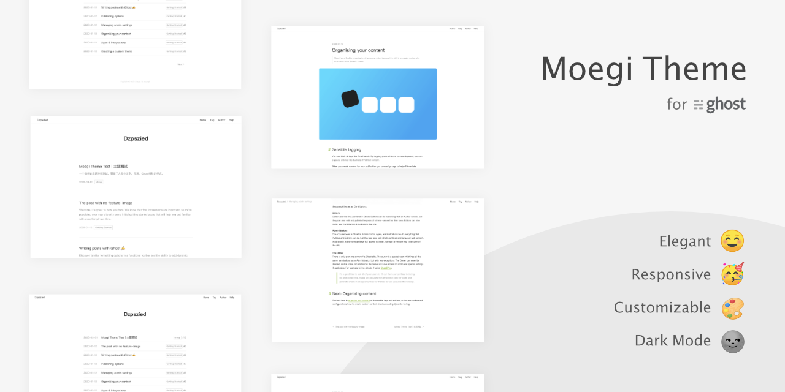

# Moegi
[](https://github.com/TryGhost/Ghost)
[](https://github.com/TryGhost/Ghost)
[](https://github.com/moegi-design/ghost-theme-Moegi/actions)
[](https://github.com/moegi-design/ghost-theme-Moegi/releases)



## 下载

### 稳定版本

每隔几次提交会发布一个稳定版本。去往 [Releases](https://github.com/moegi-design/ghost-theme-Moegi/releases) 页面下载。

### 开发版本

本仓库的每次提交都会由 Github Actions 自动打包在 [dist 分支](https://github.com/moegi-design/ghost-theme-Moegi/tree/dist)。开发渠道并不稳定，仅适合作为新功能体验。 [直接下载最新zip包](https://github.com/moegi-design/ghost-theme-Moegi/archive/dist.zip)。

## 开发

Moegi 主题使用 [Vite](https://github.com/vitejs/vite) + [Tailwind CSS](https://github.com/tailwindlabs/tailwindcss) 构建。在开发前需要配置 Node 环境。

```shell
# Install dependencies
yarn install

# Run development server & watch for changes
yarn dev
```

开发环境下，一切修改都是热更新的——如果本地启动了 Ghost 实例，修改模板文件会自动更新页面。

```shell
# Create dist file
yarn build
```

## Licence

MIT